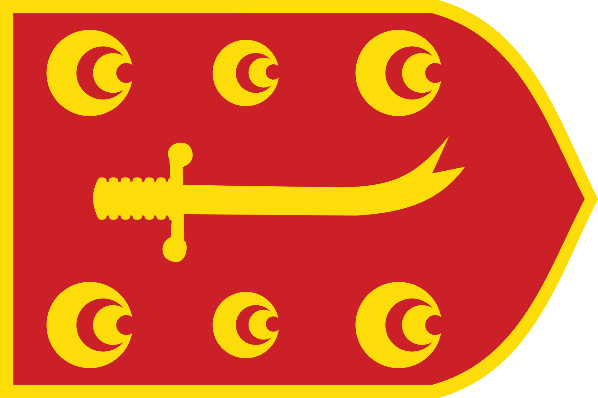
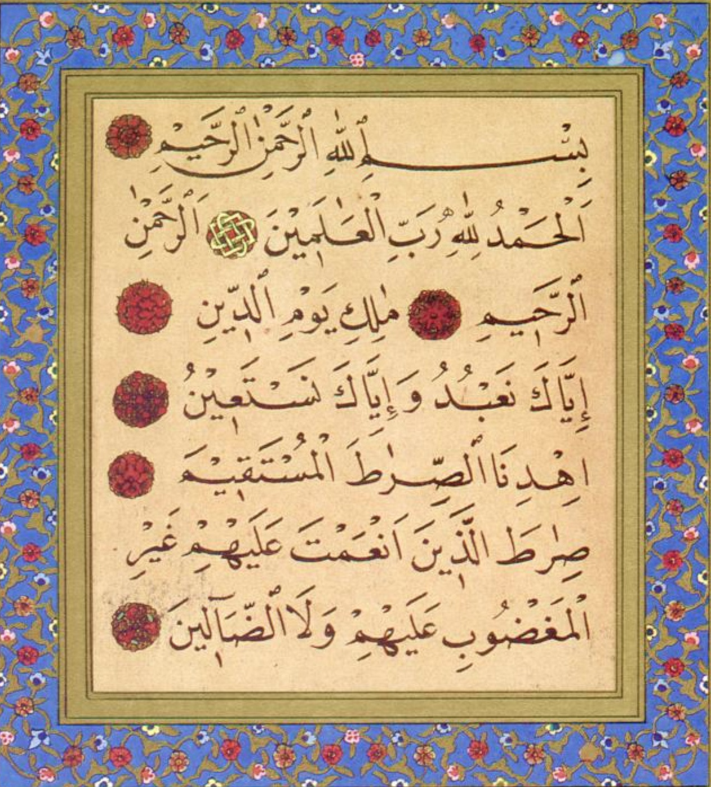
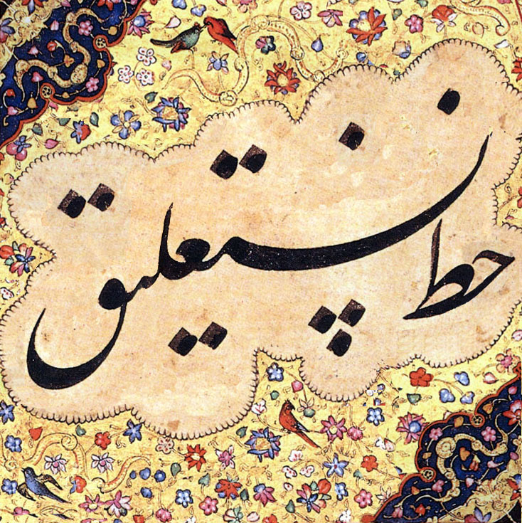

# Transliterator : Arabic الْأَبْجَدِيَّة الْعَرَبِيَّة <-> Latin based on IJMES
An application that can work both online and offline (once the website is loaded on the browser) on the [Arabic Transliterate](https://vyshantha.github.io/arabictransliterate/) website. 

Application can run on any type of device : ```Mobile, Tablet, Desktops and Laptops``` on operating systems like ```Android, Apple iOS, Apple Mac, Microsoft Windows and Linux``` on browsers such as ```Mozilla Firefox, Google Chrome, Microsoft Edge, Apple Safari, Opera and Brave```.

The application completes transliteration of texts pasted or typed into the text area from Arabic الْأَبْجَدِيَّة الْعَرَبِيَّة  to Latin script and from Latin script based to Arabic الْأَبْجَدِيَّة الْعَرَبِيَّة.

The transliteration adheres to [IJMES](https://www.cambridge.org/core/journals/international-journal-of-middle-east-studies/information/author-resources/ijmes-translation-and-transliteration-guide) for Romanisation of Arabic script.

The Arabic spoken & written in ```Algeria, Bahrain, Chad, Comoros, Djibouti, Egypt, Eritrea, Iraq, Jordan, Kuwait, Lebanon, Libya, Mauritania, Morocco, Oman, Palestine, Qatar, Saudi Arabia, Somalia, Sudan, Syria, Tanzania, Tunisia, United Arab Emirates and Yemen``` and as well as the texts in ```Arabi Malayalam, Ajami عجمي for Hausa Yoruba Swahili, Aljamiado for Old Spanish Mozarabic Ladino Aragonese Old Galician-Portuguese, Arebica آـرـەـبـٖٮڄآ for Serbo-Croatian, Arwi Tamil, Balochi بلۏچی , Belarusian بَلاروُسقایا , Berber الابجدية , Burushaski بروشسکی , Chagatai چغتای , Galal for Somali , İske imlâ for Tatar , Jawi for Malay , Kashmiri كٲشُر , Kazakh , Khowar , Kyrgyz , Ottoman Turkish , Pashto پښتو , Pegon ڤَيڮَون for Javanese Sundanese , Persian Farsi فارسی , Saraiki سرائیکی , Shahmukhi شاہ مُکھی for Punjabi , Sindhi سِنڌِي , Sorabe سُرَبِ for Malagasy , Central Kurdish Sorani , Urdu اردو , Uyghur ئۇيغۇر , Wolofal for Wolof وࣷلࣷفْ لࣵکّ  , Xiao'erjing  Xiaojing for Sinitic , Yaña imlâ ياڭا ئيملە ``` written using Arabic الْعَرَبِيَّة are supported with this application.

- To select the language to transliterate while using IJMES, hover over ```🗣``` and click  for ```Arabic```, click  for ```Persian```, click  for ```Ottoman Turkish``` and click  for ```Modern Turkish```
- To change the transliteration direction i.e. to switch between Latin or Arabic, click the swap icon   
- To copy the contents of the either Latin or Arabic text areas click the copy content icon  
- To use the Naskh Arabic font style, click the icon 
- To use the Kufi Arabic font style, click the icon 
- To use the Nastaliq Urdu font style, click the icon 

The application is yet to be perfected - "Work In Progress!" 

  
